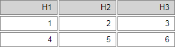

# Markdown Table Generator

Markdown Table Generator offers an intuitive and easy to use interface for creating ASCII and html data tables.

See it on action: [Markdown Table Generator](https://vikcch.github.io/markdown-table-generator/)

## Input data on a HTML table style



Use `Ctrl` + `Arrows` to navigate.

## Available options

* Increase and decrease rows and columns
* Header Alignment
* Body Alignment
* Highlight header
* Spreadsheet
* Same width columns
* Minimum column width

## Comment Sytle

* Custom
* Double slant `//`
* Slantsplat `/*` ... `*/`
* XML `<!--` ... `-->`

With _custom_ comment style, there is an option to type the comment _before_ and/or the _after_ each row.

## Output Table Style

* MySQL

```*
+--------+--------+--------+
|     H1 |     H2 |     H3 |
+--------+--------+--------+
|      1 |      2 |      3 |
|      4 |      5 |      6 |
+--------+--------+--------+
```

* Markdown

```*
|     H1 |     H2 |     H3 |
|--------|--------|--------|
|      1 |      2 |      3 |
|      4 |      5 |      6 |
```

* Unicode

```*
╔════════╤════════╤════════╗
║     H1 │     H2 │     H3 ║
╟────────┼────────┼────────╢
║      1 │      2 │      3 ║
║      4 │      5 │      6 ║
╚════════╧════════╧════════╝
```

* HTML

```*
<table>
    <thead>
        <tr><th>H1</th><th>H2</th><th>H3</th></tr>
    </thead>
    <tbody>
        <tr><td>1</td><td>2</td><td>3</td></tr>
        <tr><td>4</td><td>5</td><td>6</td></tr>
    </tbody>
</table>
```
